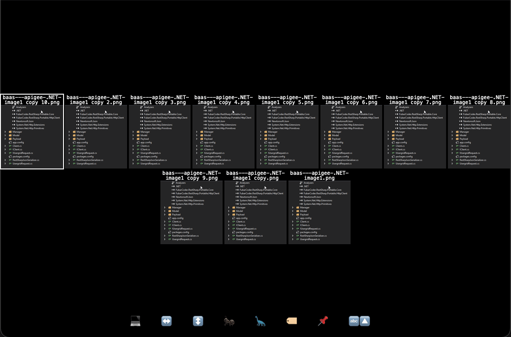

# webize

[](https://github.com/theohbrothers/webize/actions)
[](https://github.com/theohbrothers/webize/releases/)

Move away from proprietary apps to focus on a browser-first workflow.

`webize` aims to provide the most basic tools to move to a browser-first workflow. For a start, `webize` can generate a local image gallery that may be previewed in the browser at `file:///path/to/index.htm` so that local filesystem images may be consumed in the local browser.

## Philosophy

There are many OSes (platforms) with their own apps for previewing and consuming files. Among all of these interfaces, the most consistent interface is the web browser. We consume websites using the web browser, all apps are powered by the web, and almost every proprietary app out there can be replaced with a web app. So, since we are already familiar with the web browser, why aren't we using it more?

The goal of `webize` is to help the user move another step away from proprietary, platform-specific apps. Any workflow change that reduce reliance on non-browser apps is progress toward this goal.

`webize` is primarily for the use on client side for consuming local content (especially thin clients without or with limited virtualization capability). One may use `webize` on the server, but there should be better static site generators out there.

## Install

```sh
sudo wget -q https://raw.githubusercontent.com/theohbrothers/webize/master/webize -O /usr/local/bin/webize && sudo chmod +x /usr/local/bin/webize
# or
sudo curl -sL https://raw.githubusercontent.com/theohbrothers/webize/master/webize -o /usr/local/bin/webize && sudo chmod +x /usr/local/bin/webize
```

## Usage

### Gallery

At present, gallery is kept as minimalistic as possible. But it might already be better than many \[bloated\] previewing apps out there.



```sh
# Generate a `index.htm` for every descendent folder of /path/to with image files, and opens it in firefox
webize gallery /path/to/pictures | xargs firefox

# Or, open in default web browser on a mac
webize gallery /path/to/pictures | xargs open

# Cleanup once you are done
webize clean /path/to/pictures
```

Keyboard shortcuts:

| Key| Behavior |
|---|---|
| LEFT | Previous image
| RIGHT | Next image
| UP | Previous image, or previous row in tile mode
| DOWN | Next image, or next row in tile mode
| PAGEUP | Previous page, or previous page row in tile mode
| PAGEDOWN | Next page, or next page row in tile mode
| HOME | First image
| END | Last image
| ENTER | Expand image
| BACKSPACE | Back to tile mode
| SPACE | Next image
| ESC | Escape from full screen, or back to tile mode
| `F` | Full screen
| `X` | Stretch horizontal
| `Y` | Stretch vertical
| `-` | Tile smaller
| `=` | Tile larger
| `L` | Show / Hide label
| `S` | Toggle sort mode
| `P` | Pin / Unpin menu
| `C` | Copy File Path

## Development

Available as [vscode tasks](.vscode/tasks.json).

```sh
# Test script
./test.sh

# To test the gallery, make some pictures available
cp -rf /path/to/pictures .pictures

# Debug (Local browser)
./webize gallery . | xargs firefox

# Debug (Remote browser)
./webize gallery .
docker-compose up
curl --head http://yourserver:8080/.pictures/index.htm
```
